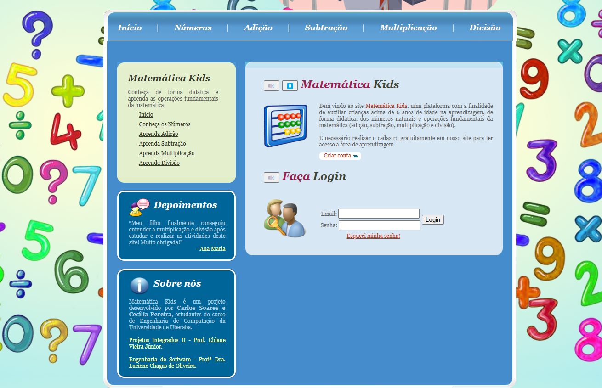

# 📘 ProjetosAspDotNet

Este repositório contém dois projetos desenvolvidos em **ASP.NET** com integração ao banco de dados **MySQL**, ambos criados no **Microsoft Visual Studio**. O primeiro projeto, "MatematicaKids", é uma plataforma web educacional para crianças, e o segundo, "NovaAcademia", é um site para uma academia fictícia com funcionalidades de cadastro de matrículas.

---

## 🛠️ Requisitos

- **Microsoft Visual Studio** (versão compatível com ASP.NET).
- **MySQL Server** instalado e configurado.
- **Conector MySQL para .NET** (MySql.Data) instalado no projeto.
- **.NET Framework** ou **.NET Core** (dependendo da versão do ASP.NET usada nos projetos).
- Navegador web (Chrome, Firefox, etc.) para acessar os sites.

---

## 📂 Estrutura do Repositório

O repositório contém duas pastas: a pasta `MatematicaKids` com os arquivos do projeto de mesmo nome, e a pasta `NovaAcademia` com os arquivos do projeto de mesmo nome.

---

## ▶️ Como Executar os Códigos

### MatematicaKids
1. **Configurar o Banco de Dados:**
   - Certifique-se de que o MySQL Server está configurado e pronto para uso.    

2. **Abrir o Projeto:**
   - Clone este repositório (veja "Como baixar o repositório" abaixo).
   - Abra a pasta `MatematicaKids` no Microsoft Visual Studio.

3. **Configurar a Conexão:**
   - No código, ajuste a string de conexão com o MySQL (usuário, senha, host, etc.) no arquivo de configuração do projeto.

4. **Executar:**
   - Pressione `F5` no Visual Studio para compilar e rodar o projeto.
   - O site será aberto no navegador, permitindo o uso da plataforma educacional.

### NovaAcademia
1. **Configurar o Banco de Dados:**
   - Certifique-se de que o MySQL Server está configurado e pronto para uso.    

2. **Abrir o Projeto:**
   - Clone este repositório (veja "Como baixar o repositório" abaixo).
   - Abra a pasta `NovaAcademia` no Microsoft Visual Studio.

3. **Configurar a Conexão:**
   - No código, ajuste a string de conexão com o MySQL (usuário, senha, host, etc.) no arquivo de configuração do projeto.

4. **Executar:**
   - Pressione `F5` no Visual Studio para compilar e rodar o projeto.
   - O site será aberto no navegador, permitindo o acesso às páginas e o cadastro de matrículas.

---

## 📥 Como Baixar o Repositório

1. Clique no botão verde "Code" no topo da página do GitHub.
2. Selecione "Download ZIP" e extraia o arquivo no seu computador.
3. Ou use o Git: `git clone https://github.com/cstavaresj/ProjetosAspDotNet.git`

---

## 📸 Screenshots

### Nova Academia

### Matemática Kids
